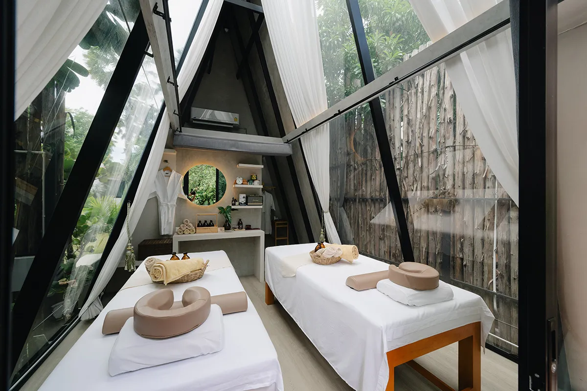
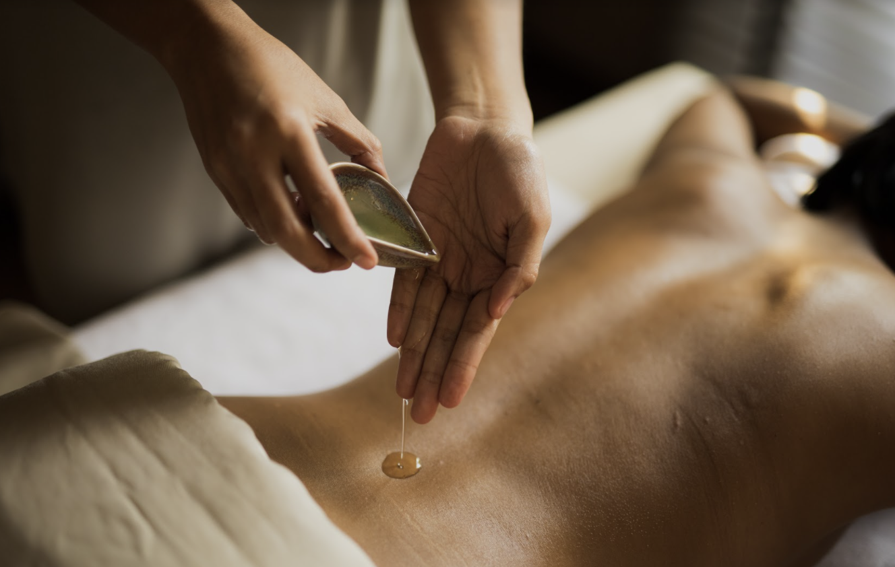

# AromaHaven: สวรรค์แห่งการนวดผ่อนคลาย (My-Business-Web)

## 🎯 ชื่อและคำอธิบายโปรเจค

**ชื่อโปรเจค:** AromaHaven: นวดผ่อนคลายด้วยน้ำมันหอมระเหยบริสุทธิ์
**คำอธิบาย:** โปรเจคนี้คือการพัฒนาเว็บไซต์สำหรับธุรกิจร้านนวดโดยจัดทำขึ้นเพื่อส่งมอบงาน Assignment #1 แสดงให้เห็นถึงการใช้ Semantic HTML

## 📁 โครงสร้างไฟล์

my-business-web/
├── index.html
├── about.html
├── services.html
├── contact.html
├── images/
│ ├── logo.png
│ ├── team-member-1.jpg
│ └── ...
└── README.md

## 📸 รูปหน้าจอทั้งหมด

![ภาพหน้าจอของหน้าแรก ] 
![ภาพหน้าจอของหน้าเกี่ยวกับ InMyWash] 
![ภาพหน้าจอของหน้าบริการ InMyWash] 
![ภาพหน้าจอของหน้าติดต่อ InMyWash] 

## 🔗 ลิงก์เข้าไปในแต่ละหน้า

| ชื่อหน้า  | ลิงก์                               |
| :-------- | :---------------------------------- |
| หน้าแรก   | file:///D:/67160041/index.html   |
| เกี่ยวกับ   | file:///D:/67160041/about.html    |
| บริการ    | file:///D:/67160041/services.html |
| ติดต่อ    | file:///D:/67160041/contact.html  |